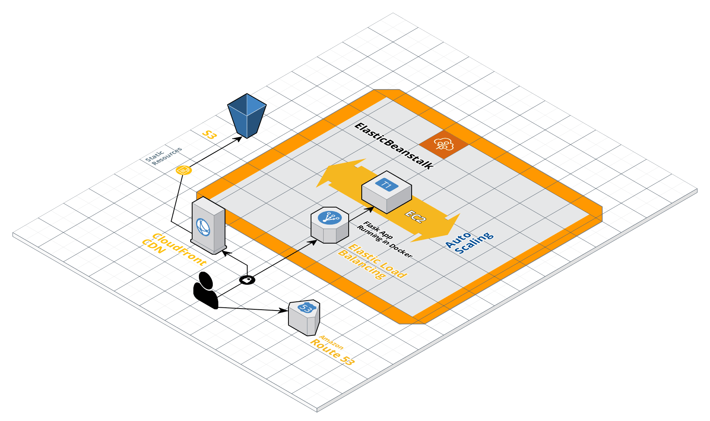

# Employees RestAPI

## Table of Contants
<!-- TOC -->
- [Requirements](#requirements)
- [Local Deployment](#local-deployment)
- [AWS deployment](#aws-deployment)
	- [Run setup](#run-setup)
	- [Run deployment script](#run-deployment-script)
	- [Architectural overview](#architectural-overview)
<!-- /TOC -->

## Requirements

* docker
* docker-compose
* python3
* python3-pip
* git
* jq
* bash


## Local Deployment

```bash
./run-local-deploy.sh
```

## AWS deployment

### Run setup

Run setup script, input your AWS credentials (AWS_SECRET_KEY_ID, AWS_SECRET_ACCESS_KEY) and default region

```bash
./setup-aws-tools.sh
```

### Run deployment script

```bash
export AWS_ACCOUNT_ID=<YOUR_ACCOUNT_ID>
# start with bash -x to debug issues
./run-aws-deploy.sh
```

Wait for the deployment script to complete and then 

wait for AWS Cloudfront distribution to propagate checking the web console or altenatively using command:

```bash
# say command is available only on OSX
aws cloudfront wait distribution-deployed --id ${AWS_CLOUDFRONT_ID} && say -v "Luciana" "Distribuição concluída"
```

and then run route53 script to create the DNS record set alias targeting the cloudfront distribution 

```bash
./run-route53-dns.sh
```

### Architectural overview




