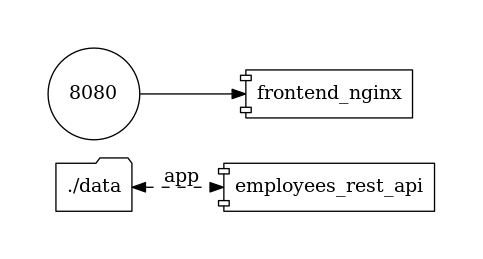

# Employees RestAPI

## Table of Contents

<!-- TOC -->
- [Employees RestAPI](#employees-restapi)
- [Table of Contants](#table-of-contants)
- [Requirements](#requirements)
- [Local Deployment](#local-deployment)
    - [Docker Compose Diagram](#docker-compose-diagram)
- [AWS deployment](#aws-deployment)
    - [Run setup](#run-setup)
    - [Run deployment script](#run-deployment-script)
    - [Architectural overview](#architectural-overview)
<!-- /TOC -->

## Requirements

* docker
* docker-compose
* python3
* python3-pip
* git
* jq
* bash


## Local Deployment

```bash
./run-local-deploy.sh
```

### Docker compose diagram



## AWS deployment

### Run setup

1. Run setup script
2. Install any dependencies missing
3. Input your AWS credentials (AWS_SECRET_KEY_ID, AWS_SECRET_ACCESS_KEY), default region
4. Set default output to 'json'

```bash
./scripts/setup-aws-tools.sh
```

### Run deployment script

```bash
export AWS_ACCOUNT_ID=<YOUR_ACCOUNT_ID>
# start with bash -x to debug issues
./run-aws-deploy.sh
```

Wait for the deployment script to complete and then 

wait for AWS Cloudfront distribution to propagate checking the web console or altenatively using command:

```bash
# NOTE :: say command is available only on OSX
aws cloudfront wait distribution-deployed --id ${AWS_CLOUDFRONT_ID} && say -v "Luciana" "Distribuição concluída"
```

and then run route53 script to create the DNS record set alias targeting the cloudfront distribution 

```bash
./scripts/run-route53-dns.sh
```

### Architectural overview


